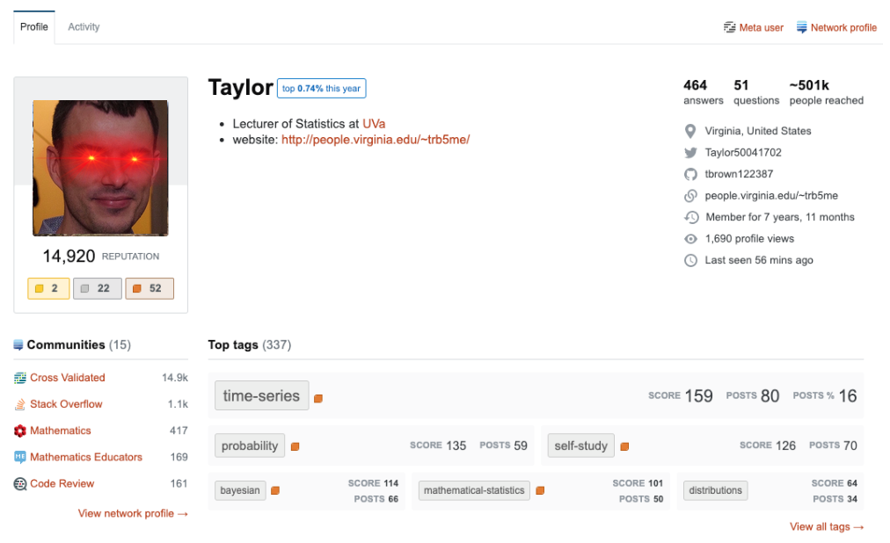

Millions of sites exist that allow individuals to post and answer questions. From personal blogs to sites like Reddit and Stack Exachange, there are a plethora of opportunities for people to interact and help eachother throughout the internet. In doing so, enclave-like internet communities begin to form, where the same individuals respond to the same types of questions and virtually interact with the same kinds of individuals. Throughout this tutorial, we will employ data mining techniques to demonstrate how to identify a set of individuals that engage with the same kind of content online. We also seek to identifying a means of determining the closest user to a given user via the types of questions they answer, i.e. the person with whom they are most likely to answer similar questions or compete for contributing the best answer. 

As a case study to demonstrate the formation of online communities, we will walk through an analysis of [CrossValidated](https://stats.stackexchange.com/) users. The data set that we have is pulled from Stack Exchange's Data Explorer Tool. It contains all posts answered by users with a reputation score over 10,000. The data consist of 42,739 individual observations (at the question level), answered by 104 different users. 

```{r eval = TRUE, include = FALSE}
library(ggplot2)
data <- read.csv(url('https://raw.githubusercontent.com/bkatcher4/DataMiningFinal/master/question_metrics_power_users.csv'))

#remove accepted_a_id
data <- subset(data, select = -c(accepted_a_id) )
```


We can preview the first six rows of data here: 
```{r eval = TRUE, echo = FALSE}
head(data)
names <- c(23:126)
data[,names] <- lapply(data[,names] , factor)
```

# Network Analysis:

We first looked at a network anlaysis approach via spectral clustering. We seek to identify communities of nodes (users) based on the edges that connect them (answering the same questions). In doing so, we conduct matricies of edges and nodes and compute the eigenvalues (spectrum) of these matricies and then use k-means clustering to cluster users. 

We cast our data into a network by making each of the users in our data set a node and the links which connecting them questions both users have provided answers to, such that these links are weighted by how many questions the two of users have provided answers for.

Source: [Spectral Clustering](https://towardsdatascience.com/spectral-clustering-aba2640c0d5b)
Source: [A Tutorial on Spectral Clustering](https://www.cs.cmu.edu/~aarti/Class/10701/readings/Luxburg06_TR.pdf)


### Spectral Clustering
```{r eval = TRUE}
#load dataset
questions <- read.csv(url('https://raw.githubusercontent.com/bkatcher4/DataMiningFinal/master/question_metrics_power_users.csv'))

#initalize adjacency matrix:
adjacency_matrix <- matrix(0,(ncol(questions)-23),(ncol(questions)-23))
for(user_a in 1:104)
{
  for(user_b in 1:104)
  {
    if(user_a > user_b)
    {
      answered_by_user_a <- questions[,c(user_a+23)]
      answered_by_user_a <- ((answered_by_user_a > 0)*1)
      answered_by_user_b <- questions[,c(user_b+23)]
      answered_by_user_b <- ((answered_by_user_b > 0)*1)
      adjacency_matrix[user_a, user_b] <- sum(questions[,c(user_a+23)] == 1 & questions[,c(user_b+23)] == 1)
      adjacency_matrix[user_b, user_a] <- sum(questions[,c(user_b+23)] == 1 & questions[,c(user_a+23)] == 1)
    }
  }
}

# initalize degree matrix:
degree_matrix <- matrix(0,(ncol(questions)-23),(ncol(questions)-23))
for(user_a in 1:104)
{
  degree_matrix[user_a, user_a] <- sum((adjacency_matrix[user_a,] > 0)*1)
}

#compute laplacian and obtain eigenvectors 
laplacian_matrix <- degree_matrix - adjacency_matrix
eigen_object <- eigen(x=laplacian_matrix)
number_of_participants <-  nrow(laplacian_matrix)

# clustering
set.seed(666)

max_number_of_clusters <- 52
SSE = numeric(max_number_of_clusters)
for(number_of_clusters in 1:max_number_of_clusters){
  X = eigen_object$vectors[, number_of_participants-(1:number_of_clusters)] # get the smallest k non-zero eigevectors
  km = kmeans(X, centers=number_of_clusters, nstart = 100) # run kmeans
  SSE[number_of_clusters] = km$tot.withinss   # calculate the SSE
}

#plots
plot(1:max_number_of_clusters, SSE, type='o', las=1, xlab="Number of Clusters")
plot(eigen_object$values[number_of_participants-(1:max_number_of_clusters)], xlab="Number of Clusters", ylab="Eigenvalues")
plot(diff(eigen_object$values[number_of_participants-(1:max_number_of_clusters)]), ylab="Difference Between Eigenvalues", xlab ="Eigenvaues")

number_of_clusters <- 8
X = eigen_object$vectors[, number_of_participants-(1:number_of_clusters)] # get the smallest k non-zero eigevectors
km = kmeans(X, centers=number_of_clusters, nstart=100)  # run k-means 

single_user_clusers <- which(km$size == 1)
outlier_indicies <- rep(0, length(single_user_clusers))
outlier_user_ids <- rep(0, length(single_user_clusers))
for(index in 1:length(single_user_clusers))
{
  outlier_indicies[index] <- which(km$cluster == single_user_clusers[index])  
  outlier_user_ids[index] <- labels[which(km$cluster == single_user_clusers[index])]  
}
```

Based on the plots, we choose a value of K=8 for our spectral clustering based on users who answer the same questions. Based on our anlaysis of our 8 clusters, it appears there are three relatively large groups (44 people, 30 people, and 19 people) who all go after the same questions, and there is a smaller group of seven individuals, and then four outliers who seem to not answer many of the same quesions.
```{r eval = TRUE}
table(km$cluster)

print(outlier_user_ids)
```

# Regression Model:

This approach gave us an idea of which users are most likely to attempt to answer the same questions but leaves us with no idea why these questions are answered and what users look for in a question they decide to take time to answer.To answer this we used a model which calculated the likelihood of a question being answered on the platform. The model used feaures engineered from the content of the question's title, body and the tags it was posted with along metadata about the question. As you can see, we have the question number, an indicator for whether the question was answered, the number of characters and words in the body of the question and the title of the question, the number of tags on the post, the number of tags in the body, the number of tags in the title, the number of paragraphs in the body, the number of code snippets, the number of plots, the number of "stop words" (words that don't mean anything in a natural langauage processing context such as articles, prepositions, etc.), the number of question marks in the title, the number of question marks in the body, the popularity of the most and least popular tags the question was posted with, and scores to bin the popuarities of both tags, and the frequency with which questions with those tags are answered, and one-hot encoding for whether a given user answered the question. This data represents characteristics about the questions and is very similar to data that could be scraped and created (via feature engieering) from any given forum site, such as Reddit, Quora, or another quesiton and answer-oriented site. 

We augmented this model by redefining success from wether or not a question was had an accepted answer to wether or not a particular user provided an answer for a given question. Our plan is to run this model on each of our 104 users produced coeffeiceints which described the log odds ratio of the impact of a certain variable (for example, the verbosity of the post) on their propensity to answer particular question, and so we know that users with similar coefficient values have similar propensities to respond to a certain question with that characteristic. 

Therefore, we build a dataset containing 104 observations (one for each user) contianing their vector of betas. We run a seperate logistic regression for each user where the outcome is whether they answer the question and the predictors are a vector of question characteristics. While in theory, we could employ other types of regression, i.e. logsitic LASSO, logistic ridge, or logistic elastic net (thereby adding a penalty term to the regression, and beneficial for conducting variable selection), we elected not because of the extreme bias in some of our data, e.g. User 8 only answers 4 questions, and to run 10-fold crossvalidation on that would be impractical due to some folds thus not having any "answered" outcomes, and the length of time it would take to run 104 10-fold crossvalidation regressions.

### Simple Logistic Regression
```{r eval = TRUE, warning = FALSE}
library(tibble)

# intialize tibble to store coefficients
linear_model_betas <- tibble(name.repair=c("X1", 'X2', 'X3', 'X4', 'X5', 'X6', 'X7', 'X8', 'X9', 'X10', 'X11'))
logistic_model_betas <- matrix(0, nrow(laplacian_matrix), 11)

# loop across all users
for(user in 1:104)
{
  #subset data frame
  answered_by_user <- questions[,c(3:22, (user+23))]
  predictors <- questions[,c(10, 11, 13, 14, 9, 15, 19, 20, 22, 21)]
  response <- ((questions[,c(user+23)] > 0)*1)
  features_of_questions_answered_by_user <- data.frame(response,predictors)
  # run model and store beta coefficients and store it in a matrix
  logistic_model_betas[user,] <- unname(glm(features_of_questions_answered_by_user, family="binomial"(link = "logit"))$coefficients)
}
```

Using this regression, we end up with a dataset containing data regarding the impact of each of the factors we identify on the likelihood that a given user will answer a question. Now that we have run the regressions, we can preview the data (including user names as row labels):

```{r eval = TRUE}
#remove X labels
t_lmb =  data.frame(logistic_model_betas)

#rename variables in tibble 
tibble_names <- names(data[,names])
rownames(t_lmb) <- tibble_names

#preview data
head(t_lmb)
```


Now that we have our dataset, we can begin conducint clustering analysis to see similarities in the characterisitcs of users who answer similar questions. In order to do this, we decide to explore different metrics of distance between users, as well as different ways of clustering users. We will begin by employing hierarchical clustering, then K-means cluster, and explore other types of clustering such as c-means clustering and spectral clustering. 

We first begin by exploring distance between various users based on the coefficients. Given the number of users, it is im impractical to put all of the users on one graph, therefore, we will divide the users into relative thirds. We compute a euclidian distance between the users, and the more red the block is, the further the individuals are from eachother, whereas the more blue, the closer the individuals are to eachother

#Computing Distance between All Users:  

To compare users directly, we can compute a series of distance metrics based on their coefficient, including euclidian distance (shown in the plots below), manhattan distance, jaccard distance, and cosine distance. In order to find who the closest (or furthest) user from each other user, we can look up distances in the matricies we create specifying the distance between every user. 

Source: [Importance of Distance Metrics in Machine Learning Modelling](https://towardsdatascience.com/importance-of-distance-metrics-in-machine-learning-modelling-e51395ffe60d)

We begin by computing the distances:

```{r eval = TRUE}
library('factoextra')

#initialize the distance matricies for all different distance metrics we want to look at
manhattan_distance_matrix <- matrix(0,nrow(laplacian_matrix),nrow(laplacian_matrix))
euclidean_distance_matrix <- matrix(0,nrow(laplacian_matrix),nrow(laplacian_matrix))
cosine_distance_matrix <- matrix(0,nrow(laplacian_matrix),nrow(laplacian_matrix))
jaccard_distance_matrix <- matrix(0,nrow(laplacian_matrix),nrow(laplacian_matrix))

#initialize the list of all the different distance metrics we want to look at
manhattan_distance <- rep(0, ((nrow(laplacian_matrix)^2/2)-(nrow(laplacian_matrix)/2)))
euclidean_distance <- rep(0, ((nrow(laplacian_matrix)^2/2)-(nrow(laplacian_matrix)/2)))
cosine_distance <- rep(0, ((nrow(laplacian_matrix)^2/2)-(nrow(laplacian_matrix)/2)))
jaccard_distance <- rep(0, ((nrow(laplacian_matrix)^2/2)-(nrow(laplacian_matrix)/2)))

index <- 0  
#loop through all origin users
for(user_a in 1:104)
{
  #loop through all destination users
  for(user_b in 1:104)
  {
    #dont duplicate calculations
    if(user_a > user_b)
    {
      #calculate each of the distance metrics  
      manhattan_distance_a_b <- sum(abs(logistic_model_betas[user_a,] - logistic_model_betas[user_b,]))
      euclidean_distance_a_b <- sqrt(sum((logistic_model_betas[user_a,] - logistic_model_betas[user_b,])^2))
      cosine_distance_a_b <- 1 - (sum(logistic_model_betas[user_a,] * logistic_model_betas[user_b,]) / sqrt((sum(logistic_model_betas[user_a,]^2)*sum(logistic_model_betas[user_b,]^2))))
      jacard_distance_a_b <- 1 - (sum(logistic_model_betas[user_a,] * logistic_model_betas[user_b,]) / sum(logistic_model_betas[user_a,] + logistic_model_betas[user_b,] - (logistic_model_betas[user_a,] * logistic_model_betas[user_b,])))
      
      #assign distances to thier respctive positions in the distance matricies
      manhattan_distance_matrix[user_a, user_b] <- manhattan_distance_a_b
      euclidean_distance_matrix[user_a, user_b] <- euclidean_distance_a_b
      cosine_distance_matrix[user_a, user_b] <- cosine_distance_a_b
      jaccard_distance_matrix[user_a, user_b] <- jacard_distance_a_b
      
      manhattan_distance_matrix[user_b, user_a] <- manhattan_distance_a_b
      euclidean_distance_matrix[user_b, user_a] <- euclidean_distance_a_b
      cosine_distance_matrix[user_b, user_a] <- cosine_distance_a_b
      jaccard_distance_matrix[user_b, user_a] <- jacard_distance_a_b
     
      #add distances to their respective lists 
      index <- index + 1 
      manhattan_distance[index] <- manhattan_distance_a_b
      euclidean_distance[index] <- euclidean_distance_a_b
      cosine_distance[index] <- cosine_distance_a_b
      jaccard_distance[index] <- jacard_distance_a_b
    }
  }
}

```

Using various distance metrics, we can identify the most similar user to a given user. Take for example, we want to identify who the closest person is to User 8336.



We can look up in our matricies the shortest distance between this user and all other users and find who the closest individual is:

```{r eval = TRUE}
person_of_interest <- "user8336_flag" #my muse

#find the users nearest to our person of interestby each distance metric and by from the network we casted the data into
adjacency_neighbor <- labels[which(adjacency_matrix[which(labels == "user8336_flag"),] == max(adjacency_matrix[which(labels == "user8336_flag"),]))]

manhattan_neighbor <- labels[which(manhattan_distance_matrix[which(labels == "user8336_flag"),] == min(manhattan_distance_matrix[which(labels == "user8336_flag"),][manhattan_distance_matrix[which(labels == "user8336_flag"),] > 0]))]

euclidean_neighbor <- labels[which(euclidean_distance_matrix[which(labels =="user8336_flag"),] == min(euclidean_distance_matrix[which(labels == "user8336_flag"),][euclidean_distance_matrix[which(labels == "user8336_flag"),] > 0]))]
             
cosine_neighbor <- labels[which(cosine_distance_matrix[which(labels == "user8336_flag"),] == min(cosine_distance_matrix[which(labels == "user8336_flag"),][cosine_distance_matrix[which(labels == "user8336_flag"),] > 0]))]
             
jaccard_neighbor <- labels[which(jaccard_distance_matrix[which(labels == "user8336_flag"),] == min(jaccard_distance_matrix[which(labels == "user8336_flag"),][jaccard_distance_matrix[which(labels == "user8336_flag"),] > 0]))]
```

Based on each of these distance metrics, here is the closest user to user 8336:
```{r eval = TRUE}

#Adjacency 
adjacency_neighbor

#Manhattan Distance
manhattan_neighbor

#Euclidian Distance:
euclidean_neighbor

#Cosine Distance:
cosine_neighbor

#Jaccard Distance:
jaccard_neighbor

```

So while each distance metric gives a different user, we have a series of candidates who we believe are relatively close to our user of interest.


We can see some of the visualization of these distance metrics here (euclidian distance):

```{r eval = TRUE}
res.dist <- get_dist(t_lmb[1:35,], stand = TRUE, method = "euclidian")
fviz_dist(res.dist, 
   gradient = list(low = "#00AFBB", mid = "white", high = "#FC4E07"))

res.dist2 <- get_dist(t_lmb[36:70,], stand = TRUE, method = "euclidian")
fviz_dist(res.dist2, 
   gradient = list(low = "#00AFBB", mid = "white", high = "#FC4E07"))


res.dist3 <- get_dist(t_lmb[71:104,], stand = TRUE, method = "euclidian")
fviz_dist(res.dist3, 
   gradient = list(low = "#00AFBB", mid = "white", high = "#FC4E07"))
```


## Hierarchical Clustering 

We begin by computing the pairwise dissimilarity between users, which is defined as the Euclidian distance between points. From this, we conduct hierarchical clustering and create a dendrogram from agglomerative hierarchical clustering. In doing so, we use complete linkage, which computes cluster dissimilarity as the largest dissimilarity between pairs in two sets. Therefore, on the dendrogram below, the height corresponds to the dissimlarity between the most dissimlar points in the two clusters. 

Source: [Clustering](https://mdporter.github.io/SYS6018/lectures/04-clustering.pdf)

In order to choose the number of clusters (K), we look for regions in the dendrogram where gaps/changes occur in the height of merges, as a large jump in height corresponds to a high dissimilarity between the solutions for k and k-1 clusters. As can be seen from the plot that compares the height to the number of clusters, we see a jump between K=6 and K=7, so we elect to choose K=7 for our clustering. 

### Euclidian Distance and Complete Linkage: 

We start by exploring Hierarchical Clustering using Euclidian Distance and Complete Linkage:

```{r eval = TRUE}
#Calculate Maximum distance
distance = dist(t_lmb, method="euclidian")

#clustering
clust = hclust(distance, method="complete")      # complete linkage

#plots
plot(as.dendrogram(clust), las=1, leaflab="none", main = "Complete Linkage Clustering Dendrogram", ylab = "Height")
n = length(clust$height)     # get number of merges

plot(n:1, clust$height, type='o', xlab="K", ylab="height", las=1, 
     xlim=c(1, 52))
points(7, clust$height[n-6], col="red", pch=19) # K=7

clusterNum <- cutree(clust, k=7)     # cut so K=7
clusterData <- data.frame(cbind(clusterNum,t_lmb))
```

From here, we can determine the number of individuals in each cluster, telling us how these most active users group together:

```{r eval = TRUE}
# Produces a tbale of the number of individuals in each cluster:
table(clusterNum)
```

We can also plot who these users are based on the two highest principal components:

```{r eval = TRUE}
pca_hier = data.frame(cbind(prcomp(t_lmb, scale=FALSE)$x[, 1:2], clusterNum))  # first 2 PC
pca_hier$Cluster <- factor(pca_hier$clusterNum)
ggplot(pca_hier, aes(PC1, PC2)) + geom_point(aes(color = Cluster))

```

In the graph above, we see that, based on the two principal components, clustering seems to have worked relatively well. There is a question if perhaps the individual in group 6 should be with the other green points, but generally, absed on the principal components, we can see relaitvely clear divisions between the groups. 

From this result, we can learn a lot about which CrossValidated users try to answer similar questions. There is a group of exactly half of the top users that tend to answer the same kinds of questions, competing with eachother for the best answer and reputation points, while there are several smaller groups as well. Groups of 24, 10, and 15 people. In addition, there are three individuals that seem to be "in a league of their own", meaning that they do not seem to answer the same questions as others. It's worthwhile to try and explore who these individuals are:

```{r eval = TRUE}
rownames(clusterData[clusterData$clusterNum>4,])
```
We can see that these three "unique" users are users number 8, 251, and 8373. 


### Manhattan Distance and Average Linkage: 

We continue by exploring Hierarchical Clustering using Manhattan Distance and Average Linkage.

```{r eval = TRUE}
#Calculate Maximum distance
distance = dist(t_lmb, method="manhattan")

#clustering
clust = hclust(distance, method="average")      # average linkage

#plots
plot(as.dendrogram(clust), las=1, leaflab="none", main = "Average Linkage Clustering Dendrogram", ylab = "Height")
n = length(clust$height)     # get number of merges

plot(n:1, clust$height, type='o', xlab="K", ylab="height", las=1, 
     xlim=c(1, 52))
points(7, clust$height[n-6], col="red", pch=19) # K=7

clusterNum <- cutree(clust, k=7)     # cut so K=7
clusterData <- data.frame(cbind(clusterNum,t_lmb))
```

From here, we can determine the number of individuals in each cluster, telling us how these most active users group together. It appears that there is one very large group of 90 people, two smaller groups of 4 and 6 people, but four outliers, when using average linkage and manhattan distance. 

```{r eval = TRUE}
# Produces a tbale of the number of individuals in each cluster:
table(clusterNum)
```

We can also plot who these users are based on the two highest principal components:

```{r eval = TRUE}
pca_hier = data.frame(cbind(prcomp(t_lmb, scale=FALSE)$x[, 1:2], clusterNum))  # first 2 PC
pca_hier$Cluster <- factor(pca_hier$clusterNum)
ggplot(pca_hier, aes(PC1, PC2)) + geom_point(aes(color = Cluster))

```

In the graph above, we see that, based on the two principal components, clustering seems to have worked relatively well. It is intersting to see the cutoffs between the 90 users who are all clustered together and the rest of the smaller clusters and outliers. It's also worthwhile to explore who tehse outliers are:


```{r eval = TRUE}
rownames(clusterData[clusterData$clusterNum == 3 |clusterData$clusterNum == 4 | clusterData$clusterNum == 5 | clusterData$clusterNum == 7,])
```
We can see that these three "unique" users are users number 7827, 8, 251, and 8373. As we will see, this becomes an apparent trend throughout.


## K-Means Clustering
We now move into another type of clustering, K-means. In K-means, we use the EM algoritihm applied to a Naive Bayes model. We specify the number of centroids (K). We run kmeans for multiple K and plot the value of K against the SSE in order to look for an "elbow", which is the place wehre we choose the opitmal K. The algorithm then intializes the centroids and uses the EM algorithm to iterate until there is no change in the centroid locations. 

Source: [K-means Clustering: Algorithm, Applications, Evaluation Methods, and Drawbacks](https://towardsdatascience.com/k-means-clustering-algorithm-applications-evaluation-methods-and-drawbacks-aa03e644b48a) Source: Clustering (https://mdporter.github.io/SYS6018/lectures/04-clustering.pdf) Source: [Clustering.R](https://mdporter.github.io/SYS6018/R/clustering.R)

```{r eval = TRUE}
library(stats)

# define the data
km_lmb = t_lmb                

#-- Run kmeans for multiple K
Kmax = 40                                 
SSE = numeric(Kmax)                       # initiate SSE vector
for(k in 1:Kmax){
  km = kmeans(km_lmb, centers=k, nstart=25)    # use 25 starts
  SSE[k] = km$tot.withinss                # get SSE
}

#-- Plot results
plot(1:Kmax, SSE, type='o', las=1, xlab="K")
```

Based on the graph above, it looks like the optimal K is k=7, as that's where there is a kink point in the graph. 

```{r eval = TRUE}
set.seed(42069)
km = kmeans(km_lmb, centers=7, nstart=25) # use K=7
km_lmb = data.frame(cbind(km$cluster, t_lmb))
table(km$cluster)
```

Based on these results, we see the same general pattern as above. While we don't see one large group, we see four groups of rouhgly 15-30 people, a smaller group of 6 people, and 2 outliers of only one person:

```{r eval = TRUE}
rownames(km_lmb[km_lmb$V1==1 | km_lmb$V1==6,])
```

We discover that user 8 and user 251 are once again outliers, which is the same result that we observe with hierarchical clustering. We can visualize the clusters again based on a plot of the two principal components, with coloring by cluster:

```{r eval = TRUE}
pca_km = data.frame(cbind(prcomp(t_lmb, scale=FALSE)$x[, 1:2], km$cluster))  # first 2 PC
pca_km$cluster <- as.factor(pca_km$V3)
ggplot(pca_km, aes(PC1, PC2)) + geom_point(aes(color = cluster))
```

## Fuzzy C-Means

In Fuzzy C-Means, each data point (user) is not assigned to just one cluster (like k-means). Instead, it is a member of all clusters with varying degrees of memebrship between 0 and 1. FCM works as an iterative clustering algorithim that partitions the data into a number of clusters (in our case, 7) and then minimizes the weighted within-group sum of squared errors. 

Source: [Fuzzy C-Means Clustering](https://www.rdocumentation.org/packages/ppclust/versions/0.1.3/topics/fcm)

```{r eval = TRUE}

library("cluster")
library("factoextra")
library("magrittr")
library('ppclust')


# define the data
fcm_lmb = t_lmb                

#-- Run c-means for K = 7 (using the same number of clusters as for k-means and hierarchical)
fcm = fcm(x = fcm_lmb, centers = 7, nstart = 10, numseed=3000)   # use 10 starts


# create cluster plot 
res.fcm2 <- ppclust2(fcm, "kmeans")
fviz_cluster(res.fcm2, data = fcm_lmb, 
  ellipse.type = "convex",
  palette = "jco",
  labelsize = 0,
  repel = FALSE)

```

With c-means, we obtain the probability of picking each observation being in each cluster, which can be viewed below for the first few observations:
```{r eval = TRUE}
head(fcm$u)
```

We can also see the distance between each point and the centroid of the clusters for the first few observations:
```{r eval = TRUE}
head(fcm$d)
```

We can see that using fuzzy c-means and picking the probabilistically most likely cluster gives us a more even distribution, despite User 8 being far away on the above plot.
```{r eval = TRUE}
fcm$csize
```


# Conclusions and Takeaways:

In conclusion, we were able to confirm our hypothesis that clusters of individuals do form on the internet message boards such as CrossValidated. Using four different clustering techniques (spatial, k-means, fuzzy c-means, and hierarchical) as well as computing a number of different distance metrics, we were able to identify outliers in various communities, User 8, for example.

We were also able to determine that most clustering methods find a few bigger groups (sometimes very large), a few smaller groups, and a few outliers among the individuals who were most active on CrossValidated. These techniques can be applied to pretty much any different message board in order to gain inisghts about how communities cluster and what individuals tend to engage with the same type of content. 
